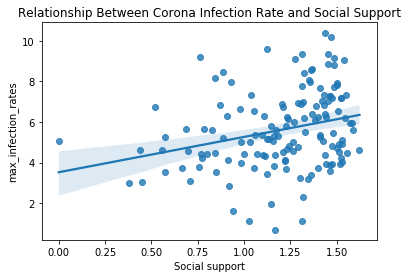

# COVID-19-dataset-and-World-Happiness-Report-Analysis
 I performed Data Analysis on COVID 19 dataset by John Hopkins University and World Happiness Report and found really interesting results. It shows that people living in developed countries are more prone to infection of the Corona Virus than people living in less developed countries.
# Welcome to the Covid 19 Data Analysis Note book
### Author : Poshan Pandey
### Date : 6/5/2020

## Let's import the modules


```python
import pandas as pd
import numpy as np
import seaborn as sns
import matplotlib.pyplot as plt
print("All modules imported!")
```

    All modules imported!
    

##  Let's import the covid 19 datasets by John Hopkins University
https://github.com/CSSEGISandData/COVID-19


```python
corona_dataset_csv = pd.read_csv("Datasets/time_series_covid19_confirmed_global.csv")
```


```python
corona_dataset_csv.head()
```


<div>
<style scoped>
    .dataframe tbody tr th:only-of-type {
        vertical-align: middle;
    }

    .dataframe tbody tr th {
        vertical-align: top;
    }

    .dataframe thead th {
        text-align: right;
    }
</style>
<table border="1" class="dataframe">
  <thead>
    <tr style="text-align: right;">
      <th></th>
      <th>Province/State</th>
      <th>Country/Region</th>
      <th>Lat</th>
      <th>Long</th>
      <th>1/22/20</th>
      <th>1/23/20</th>
      <th>1/24/20</th>
      <th>1/25/20</th>
      <th>1/26/20</th>
      <th>1/27/20</th>
      <th>...</th>
      <th>5/26/20</th>
      <th>5/27/20</th>
      <th>5/28/20</th>
      <th>5/29/20</th>
      <th>5/30/20</th>
      <th>5/31/20</th>
      <th>6/1/20</th>
      <th>6/2/20</th>
      <th>6/3/20</th>
      <th>6/4/20</th>
    </tr>
  </thead>
  <tbody>
    <tr>
      <th>0</th>
      <td>NaN</td>
      <td>Afghanistan</td>
      <td>33.0000</td>
      <td>65.0000</td>
      <td>0</td>
      <td>0</td>
      <td>0</td>
      <td>0</td>
      <td>0</td>
      <td>0</td>
      <td>...</td>
      <td>11831</td>
      <td>12456</td>
      <td>13036</td>
      <td>13659</td>
      <td>14525</td>
      <td>15205</td>
      <td>15750</td>
      <td>16509</td>
      <td>17267</td>
      <td>18054</td>
    </tr>
    <tr>
      <th>1</th>
      <td>NaN</td>
      <td>Albania</td>
      <td>41.1533</td>
      <td>20.1683</td>
      <td>0</td>
      <td>0</td>
      <td>0</td>
      <td>0</td>
      <td>0</td>
      <td>0</td>
      <td>...</td>
      <td>1029</td>
      <td>1050</td>
      <td>1076</td>
      <td>1099</td>
      <td>1122</td>
      <td>1137</td>
      <td>1143</td>
      <td>1164</td>
      <td>1184</td>
      <td>1197</td>
    </tr>
    <tr>
      <th>2</th>
      <td>NaN</td>
      <td>Algeria</td>
      <td>28.0339</td>
      <td>1.6596</td>
      <td>0</td>
      <td>0</td>
      <td>0</td>
      <td>0</td>
      <td>0</td>
      <td>0</td>
      <td>...</td>
      <td>8697</td>
      <td>8857</td>
      <td>8997</td>
      <td>9134</td>
      <td>9267</td>
      <td>9394</td>
      <td>9513</td>
      <td>9626</td>
      <td>9733</td>
      <td>9831</td>
    </tr>
    <tr>
      <th>3</th>
      <td>NaN</td>
      <td>Andorra</td>
      <td>42.5063</td>
      <td>1.5218</td>
      <td>0</td>
      <td>0</td>
      <td>0</td>
      <td>0</td>
      <td>0</td>
      <td>0</td>
      <td>...</td>
      <td>763</td>
      <td>763</td>
      <td>763</td>
      <td>764</td>
      <td>764</td>
      <td>764</td>
      <td>765</td>
      <td>844</td>
      <td>851</td>
      <td>852</td>
    </tr>
    <tr>
      <th>4</th>
      <td>NaN</td>
      <td>Angola</td>
      <td>-11.2027</td>
      <td>17.8739</td>
      <td>0</td>
      <td>0</td>
      <td>0</td>
      <td>0</td>
      <td>0</td>
      <td>0</td>
      <td>...</td>
      <td>70</td>
      <td>71</td>
      <td>74</td>
      <td>81</td>
      <td>84</td>
      <td>86</td>
      <td>86</td>
      <td>86</td>
      <td>86</td>
      <td>86</td>
    </tr>
  </tbody>
</table>
<p>5 rows × 139 columns</p>
</div>


## Checking the shape of the data


```python
corona_dataset_csv.shape
```


    (266, 139)


## Deleting unnecessary columns


```python
corona_dataset_csv.drop(["Lat", "Long"], axis = 1, inplace = True)
corona_dataset_csv.head(15)
```


<div>
<style scoped>
    .dataframe tbody tr th:only-of-type {
        vertical-align: middle;
    }

    .dataframe tbody tr th {
        vertical-align: top;
    }

    .dataframe thead th {
        text-align: right;
    }
</style>
<table border="1" class="dataframe">
  <thead>
    <tr style="text-align: right;">
      <th></th>
      <th>Province/State</th>
      <th>Country/Region</th>
      <th>1/22/20</th>
      <th>1/23/20</th>
      <th>1/24/20</th>
      <th>1/25/20</th>
      <th>1/26/20</th>
      <th>1/27/20</th>
      <th>1/28/20</th>
      <th>1/29/20</th>
      <th>...</th>
      <th>5/26/20</th>
      <th>5/27/20</th>
      <th>5/28/20</th>
      <th>5/29/20</th>
      <th>5/30/20</th>
      <th>5/31/20</th>
      <th>6/1/20</th>
      <th>6/2/20</th>
      <th>6/3/20</th>
      <th>6/4/20</th>
    </tr>
  </thead>
  <tbody>
    <tr>
      <th>0</th>
      <td>NaN</td>
      <td>Afghanistan</td>
      <td>0</td>
      <td>0</td>
      <td>0</td>
      <td>0</td>
      <td>0</td>
      <td>0</td>
      <td>0</td>
      <td>0</td>
      <td>...</td>
      <td>11831</td>
      <td>12456</td>
      <td>13036</td>
      <td>13659</td>
      <td>14525</td>
      <td>15205</td>
      <td>15750</td>
      <td>16509</td>
      <td>17267</td>
      <td>18054</td>
    </tr>
    <tr>
      <th>1</th>
      <td>NaN</td>
      <td>Albania</td>
      <td>0</td>
      <td>0</td>
      <td>0</td>
      <td>0</td>
      <td>0</td>
      <td>0</td>
      <td>0</td>
      <td>0</td>
      <td>...</td>
      <td>1029</td>
      <td>1050</td>
      <td>1076</td>
      <td>1099</td>
      <td>1122</td>
      <td>1137</td>
      <td>1143</td>
      <td>1164</td>
      <td>1184</td>
      <td>1197</td>
    </tr>
    <tr>
      <th>2</th>
      <td>NaN</td>
      <td>Algeria</td>
      <td>0</td>
      <td>0</td>
      <td>0</td>
      <td>0</td>
      <td>0</td>
      <td>0</td>
      <td>0</td>
      <td>0</td>
      <td>...</td>
      <td>8697</td>
      <td>8857</td>
      <td>8997</td>
      <td>9134</td>
      <td>9267</td>
      <td>9394</td>
      <td>9513</td>
      <td>9626</td>
      <td>9733</td>
      <td>9831</td>
    </tr>
    <tr>
      <th>3</th>
      <td>NaN</td>
      <td>Andorra</td>
      <td>0</td>
      <td>0</td>
      <td>0</td>
      <td>0</td>
      <td>0</td>
      <td>0</td>
      <td>0</td>
      <td>0</td>
      <td>...</td>
      <td>763</td>
      <td>763</td>
      <td>763</td>
      <td>764</td>
      <td>764</td>
      <td>764</td>
      <td>765</td>
      <td>844</td>
      <td>851</td>
      <td>852</td>
    </tr>
    <tr>
      <th>4</th>
      <td>NaN</td>
      <td>Angola</td>
      <td>0</td>
      <td>0</td>
      <td>0</td>
      <td>0</td>
      <td>0</td>
      <td>0</td>
      <td>0</td>
      <td>0</td>
      <td>...</td>
      <td>70</td>
      <td>71</td>
      <td>74</td>
      <td>81</td>
      <td>84</td>
      <td>86</td>
      <td>86</td>
      <td>86</td>
      <td>86</td>
      <td>86</td>
    </tr>
    <tr>
      <th>5</th>
      <td>NaN</td>
      <td>Antigua and Barbuda</td>
      <td>0</td>
      <td>0</td>
      <td>0</td>
      <td>0</td>
      <td>0</td>
      <td>0</td>
      <td>0</td>
      <td>0</td>
      <td>...</td>
      <td>25</td>
      <td>25</td>
      <td>25</td>
      <td>25</td>
      <td>25</td>
      <td>26</td>
      <td>26</td>
      <td>26</td>
      <td>26</td>
      <td>26</td>
    </tr>
    <tr>
      <th>6</th>
      <td>NaN</td>
      <td>Argentina</td>
      <td>0</td>
      <td>0</td>
      <td>0</td>
      <td>0</td>
      <td>0</td>
      <td>0</td>
      <td>0</td>
      <td>0</td>
      <td>...</td>
      <td>13228</td>
      <td>13933</td>
      <td>14702</td>
      <td>15419</td>
      <td>16214</td>
      <td>16851</td>
      <td>17415</td>
      <td>18319</td>
      <td>19268</td>
      <td>20197</td>
    </tr>
    <tr>
      <th>7</th>
      <td>NaN</td>
      <td>Armenia</td>
      <td>0</td>
      <td>0</td>
      <td>0</td>
      <td>0</td>
      <td>0</td>
      <td>0</td>
      <td>0</td>
      <td>0</td>
      <td>...</td>
      <td>7402</td>
      <td>7774</td>
      <td>8216</td>
      <td>8676</td>
      <td>8927</td>
      <td>9282</td>
      <td>9492</td>
      <td>10009</td>
      <td>10524</td>
      <td>11221</td>
    </tr>
    <tr>
      <th>8</th>
      <td>Australian Capital Territory</td>
      <td>Australia</td>
      <td>0</td>
      <td>0</td>
      <td>0</td>
      <td>0</td>
      <td>0</td>
      <td>0</td>
      <td>0</td>
      <td>0</td>
      <td>...</td>
      <td>107</td>
      <td>107</td>
      <td>107</td>
      <td>107</td>
      <td>107</td>
      <td>107</td>
      <td>107</td>
      <td>107</td>
      <td>107</td>
      <td>107</td>
    </tr>
    <tr>
      <th>9</th>
      <td>New South Wales</td>
      <td>Australia</td>
      <td>0</td>
      <td>0</td>
      <td>0</td>
      <td>0</td>
      <td>3</td>
      <td>4</td>
      <td>4</td>
      <td>4</td>
      <td>...</td>
      <td>3089</td>
      <td>3090</td>
      <td>3092</td>
      <td>3092</td>
      <td>3095</td>
      <td>3098</td>
      <td>3104</td>
      <td>3104</td>
      <td>3106</td>
      <td>3110</td>
    </tr>
    <tr>
      <th>10</th>
      <td>Northern Territory</td>
      <td>Australia</td>
      <td>0</td>
      <td>0</td>
      <td>0</td>
      <td>0</td>
      <td>0</td>
      <td>0</td>
      <td>0</td>
      <td>0</td>
      <td>...</td>
      <td>29</td>
      <td>29</td>
      <td>29</td>
      <td>29</td>
      <td>29</td>
      <td>29</td>
      <td>29</td>
      <td>29</td>
      <td>29</td>
      <td>29</td>
    </tr>
    <tr>
      <th>11</th>
      <td>Queensland</td>
      <td>Australia</td>
      <td>0</td>
      <td>0</td>
      <td>0</td>
      <td>0</td>
      <td>0</td>
      <td>0</td>
      <td>0</td>
      <td>1</td>
      <td>...</td>
      <td>1058</td>
      <td>1058</td>
      <td>1058</td>
      <td>1058</td>
      <td>1058</td>
      <td>1058</td>
      <td>1059</td>
      <td>1059</td>
      <td>1060</td>
      <td>1060</td>
    </tr>
    <tr>
      <th>12</th>
      <td>South Australia</td>
      <td>Australia</td>
      <td>0</td>
      <td>0</td>
      <td>0</td>
      <td>0</td>
      <td>0</td>
      <td>0</td>
      <td>0</td>
      <td>0</td>
      <td>...</td>
      <td>440</td>
      <td>440</td>
      <td>440</td>
      <td>440</td>
      <td>440</td>
      <td>440</td>
      <td>440</td>
      <td>440</td>
      <td>440</td>
      <td>440</td>
    </tr>
    <tr>
      <th>13</th>
      <td>Tasmania</td>
      <td>Australia</td>
      <td>0</td>
      <td>0</td>
      <td>0</td>
      <td>0</td>
      <td>0</td>
      <td>0</td>
      <td>0</td>
      <td>0</td>
      <td>...</td>
      <td>228</td>
      <td>228</td>
      <td>228</td>
      <td>228</td>
      <td>228</td>
      <td>228</td>
      <td>228</td>
      <td>228</td>
      <td>228</td>
      <td>228</td>
    </tr>
    <tr>
      <th>14</th>
      <td>Victoria</td>
      <td>Australia</td>
      <td>0</td>
      <td>0</td>
      <td>0</td>
      <td>0</td>
      <td>1</td>
      <td>1</td>
      <td>1</td>
      <td>1</td>
      <td>...</td>
      <td>1618</td>
      <td>1628</td>
      <td>1634</td>
      <td>1645</td>
      <td>1649</td>
      <td>1653</td>
      <td>1663</td>
      <td>1670</td>
      <td>1678</td>
      <td>1681</td>
    </tr>
  </tbody>
</table>
<p>15 rows × 137 columns</p>
</div>


## Aggregating the data of all province/state of similar country


```python
aggregated_corona_dataset = corona_dataset_csv.groupby("Country/Region").sum()
aggregated_corona_dataset.head(10)
```


<div>
<style scoped>
    .dataframe tbody tr th:only-of-type {
        vertical-align: middle;
    }

    .dataframe tbody tr th {
        vertical-align: top;
    }

    .dataframe thead th {
        text-align: right;
    }
</style>
<table border="1" class="dataframe">
  <thead>
    <tr style="text-align: right;">
      <th></th>
      <th>1/22/20</th>
      <th>1/23/20</th>
      <th>1/24/20</th>
      <th>1/25/20</th>
      <th>1/26/20</th>
      <th>1/27/20</th>
      <th>1/28/20</th>
      <th>1/29/20</th>
      <th>1/30/20</th>
      <th>1/31/20</th>
      <th>...</th>
      <th>5/26/20</th>
      <th>5/27/20</th>
      <th>5/28/20</th>
      <th>5/29/20</th>
      <th>5/30/20</th>
      <th>5/31/20</th>
      <th>6/1/20</th>
      <th>6/2/20</th>
      <th>6/3/20</th>
      <th>6/4/20</th>
    </tr>
    <tr>
      <th>Country/Region</th>
      <th></th>
      <th></th>
      <th></th>
      <th></th>
      <th></th>
      <th></th>
      <th></th>
      <th></th>
      <th></th>
      <th></th>
      <th></th>
      <th></th>
      <th></th>
      <th></th>
      <th></th>
      <th></th>
      <th></th>
      <th></th>
      <th></th>
      <th></th>
      <th></th>
    </tr>
  </thead>
  <tbody>
    <tr>
      <th>Afghanistan</th>
      <td>0</td>
      <td>0</td>
      <td>0</td>
      <td>0</td>
      <td>0</td>
      <td>0</td>
      <td>0</td>
      <td>0</td>
      <td>0</td>
      <td>0</td>
      <td>...</td>
      <td>11831</td>
      <td>12456</td>
      <td>13036</td>
      <td>13659</td>
      <td>14525</td>
      <td>15205</td>
      <td>15750</td>
      <td>16509</td>
      <td>17267</td>
      <td>18054</td>
    </tr>
    <tr>
      <th>Albania</th>
      <td>0</td>
      <td>0</td>
      <td>0</td>
      <td>0</td>
      <td>0</td>
      <td>0</td>
      <td>0</td>
      <td>0</td>
      <td>0</td>
      <td>0</td>
      <td>...</td>
      <td>1029</td>
      <td>1050</td>
      <td>1076</td>
      <td>1099</td>
      <td>1122</td>
      <td>1137</td>
      <td>1143</td>
      <td>1164</td>
      <td>1184</td>
      <td>1197</td>
    </tr>
    <tr>
      <th>Algeria</th>
      <td>0</td>
      <td>0</td>
      <td>0</td>
      <td>0</td>
      <td>0</td>
      <td>0</td>
      <td>0</td>
      <td>0</td>
      <td>0</td>
      <td>0</td>
      <td>...</td>
      <td>8697</td>
      <td>8857</td>
      <td>8997</td>
      <td>9134</td>
      <td>9267</td>
      <td>9394</td>
      <td>9513</td>
      <td>9626</td>
      <td>9733</td>
      <td>9831</td>
    </tr>
    <tr>
      <th>Andorra</th>
      <td>0</td>
      <td>0</td>
      <td>0</td>
      <td>0</td>
      <td>0</td>
      <td>0</td>
      <td>0</td>
      <td>0</td>
      <td>0</td>
      <td>0</td>
      <td>...</td>
      <td>763</td>
      <td>763</td>
      <td>763</td>
      <td>764</td>
      <td>764</td>
      <td>764</td>
      <td>765</td>
      <td>844</td>
      <td>851</td>
      <td>852</td>
    </tr>
    <tr>
      <th>Angola</th>
      <td>0</td>
      <td>0</td>
      <td>0</td>
      <td>0</td>
      <td>0</td>
      <td>0</td>
      <td>0</td>
      <td>0</td>
      <td>0</td>
      <td>0</td>
      <td>...</td>
      <td>70</td>
      <td>71</td>
      <td>74</td>
      <td>81</td>
      <td>84</td>
      <td>86</td>
      <td>86</td>
      <td>86</td>
      <td>86</td>
      <td>86</td>
    </tr>
    <tr>
      <th>Antigua and Barbuda</th>
      <td>0</td>
      <td>0</td>
      <td>0</td>
      <td>0</td>
      <td>0</td>
      <td>0</td>
      <td>0</td>
      <td>0</td>
      <td>0</td>
      <td>0</td>
      <td>...</td>
      <td>25</td>
      <td>25</td>
      <td>25</td>
      <td>25</td>
      <td>25</td>
      <td>26</td>
      <td>26</td>
      <td>26</td>
      <td>26</td>
      <td>26</td>
    </tr>
    <tr>
      <th>Argentina</th>
      <td>0</td>
      <td>0</td>
      <td>0</td>
      <td>0</td>
      <td>0</td>
      <td>0</td>
      <td>0</td>
      <td>0</td>
      <td>0</td>
      <td>0</td>
      <td>...</td>
      <td>13228</td>
      <td>13933</td>
      <td>14702</td>
      <td>15419</td>
      <td>16214</td>
      <td>16851</td>
      <td>17415</td>
      <td>18319</td>
      <td>19268</td>
      <td>20197</td>
    </tr>
    <tr>
      <th>Armenia</th>
      <td>0</td>
      <td>0</td>
      <td>0</td>
      <td>0</td>
      <td>0</td>
      <td>0</td>
      <td>0</td>
      <td>0</td>
      <td>0</td>
      <td>0</td>
      <td>...</td>
      <td>7402</td>
      <td>7774</td>
      <td>8216</td>
      <td>8676</td>
      <td>8927</td>
      <td>9282</td>
      <td>9492</td>
      <td>10009</td>
      <td>10524</td>
      <td>11221</td>
    </tr>
    <tr>
      <th>Australia</th>
      <td>0</td>
      <td>0</td>
      <td>0</td>
      <td>0</td>
      <td>4</td>
      <td>5</td>
      <td>5</td>
      <td>6</td>
      <td>9</td>
      <td>9</td>
      <td>...</td>
      <td>7139</td>
      <td>7150</td>
      <td>7165</td>
      <td>7184</td>
      <td>7192</td>
      <td>7202</td>
      <td>7221</td>
      <td>7229</td>
      <td>7240</td>
      <td>7247</td>
    </tr>
    <tr>
      <th>Austria</th>
      <td>0</td>
      <td>0</td>
      <td>0</td>
      <td>0</td>
      <td>0</td>
      <td>0</td>
      <td>0</td>
      <td>0</td>
      <td>0</td>
      <td>0</td>
      <td>...</td>
      <td>16557</td>
      <td>16591</td>
      <td>16628</td>
      <td>16655</td>
      <td>16685</td>
      <td>16731</td>
      <td>16733</td>
      <td>16759</td>
      <td>16771</td>
      <td>16805</td>
    </tr>
  </tbody>
</table>
<p>10 rows × 135 columns</p>
</div>


## Visualizing the Corona Infection data of Nepal


```python
aggregated_corona_dataset.loc["Nepal"].plot()
plt.title("Rate of Covid 19 Growth in Nepal")
plt.legend()
```


    <matplotlib.legend.Legend at 0x21a2bd54e88>


## Calculating derivative of above curve and finding the maximum infection rate


```python
aggregated_corona_dataset.loc["Nepal"].diff().plot()
```


    <matplotlib.axes._subplots.AxesSubplot at 0x21a2be86408>


```python
aggregated_corona_dataset.loc["Nepal"].diff().max()
```


    334.0


## Finding maximum infection rate for all the countries and Adding it to new column in Dataframe


```python
countries = list(aggregated_corona_dataset.index)
max_infection_rates = []
for c in countries:
    max_infection_rates.append(aggregated_corona_dataset.loc[c].diff().max())
aggregated_corona_dataset["max_infection_rates"] = max_infection_rates
aggregated_corona_dataset.head()
```


<div>
<style scoped>
    .dataframe tbody tr th:only-of-type {
        vertical-align: middle;
    }

    .dataframe tbody tr th {
        vertical-align: top;
    }

    .dataframe thead th {
        text-align: right;
    }
</style>
<table border="1" class="dataframe">
  <thead>
    <tr style="text-align: right;">
      <th></th>
      <th>1/22/20</th>
      <th>1/23/20</th>
      <th>1/24/20</th>
      <th>1/25/20</th>
      <th>1/26/20</th>
      <th>1/27/20</th>
      <th>1/28/20</th>
      <th>1/29/20</th>
      <th>1/30/20</th>
      <th>1/31/20</th>
      <th>...</th>
      <th>5/27/20</th>
      <th>5/28/20</th>
      <th>5/29/20</th>
      <th>5/30/20</th>
      <th>5/31/20</th>
      <th>6/1/20</th>
      <th>6/2/20</th>
      <th>6/3/20</th>
      <th>6/4/20</th>
      <th>max_infection_rates</th>
    </tr>
    <tr>
      <th>Country/Region</th>
      <th></th>
      <th></th>
      <th></th>
      <th></th>
      <th></th>
      <th></th>
      <th></th>
      <th></th>
      <th></th>
      <th></th>
      <th></th>
      <th></th>
      <th></th>
      <th></th>
      <th></th>
      <th></th>
      <th></th>
      <th></th>
      <th></th>
      <th></th>
      <th></th>
    </tr>
  </thead>
  <tbody>
    <tr>
      <th>Afghanistan</th>
      <td>0</td>
      <td>0</td>
      <td>0</td>
      <td>0</td>
      <td>0</td>
      <td>0</td>
      <td>0</td>
      <td>0</td>
      <td>0</td>
      <td>0</td>
      <td>...</td>
      <td>12456</td>
      <td>13036</td>
      <td>13659</td>
      <td>14525</td>
      <td>15205</td>
      <td>15750</td>
      <td>16509</td>
      <td>17267</td>
      <td>18054</td>
      <td>866.0</td>
    </tr>
    <tr>
      <th>Albania</th>
      <td>0</td>
      <td>0</td>
      <td>0</td>
      <td>0</td>
      <td>0</td>
      <td>0</td>
      <td>0</td>
      <td>0</td>
      <td>0</td>
      <td>0</td>
      <td>...</td>
      <td>1050</td>
      <td>1076</td>
      <td>1099</td>
      <td>1122</td>
      <td>1137</td>
      <td>1143</td>
      <td>1164</td>
      <td>1184</td>
      <td>1197</td>
      <td>34.0</td>
    </tr>
    <tr>
      <th>Algeria</th>
      <td>0</td>
      <td>0</td>
      <td>0</td>
      <td>0</td>
      <td>0</td>
      <td>0</td>
      <td>0</td>
      <td>0</td>
      <td>0</td>
      <td>0</td>
      <td>...</td>
      <td>8857</td>
      <td>8997</td>
      <td>9134</td>
      <td>9267</td>
      <td>9394</td>
      <td>9513</td>
      <td>9626</td>
      <td>9733</td>
      <td>9831</td>
      <td>199.0</td>
    </tr>
    <tr>
      <th>Andorra</th>
      <td>0</td>
      <td>0</td>
      <td>0</td>
      <td>0</td>
      <td>0</td>
      <td>0</td>
      <td>0</td>
      <td>0</td>
      <td>0</td>
      <td>0</td>
      <td>...</td>
      <td>763</td>
      <td>763</td>
      <td>764</td>
      <td>764</td>
      <td>764</td>
      <td>765</td>
      <td>844</td>
      <td>851</td>
      <td>852</td>
      <td>79.0</td>
    </tr>
    <tr>
      <th>Angola</th>
      <td>0</td>
      <td>0</td>
      <td>0</td>
      <td>0</td>
      <td>0</td>
      <td>0</td>
      <td>0</td>
      <td>0</td>
      <td>0</td>
      <td>0</td>
      <td>...</td>
      <td>71</td>
      <td>74</td>
      <td>81</td>
      <td>84</td>
      <td>86</td>
      <td>86</td>
      <td>86</td>
      <td>86</td>
      <td>86</td>
      <td>8.0</td>
    </tr>
  </tbody>
</table>
<p>5 rows × 136 columns</p>
</div>


## Creating new dataframe with countries and maximum infection rate only


```python
corona_data = pd.DataFrame(aggregated_corona_dataset["max_infection_rates"])
corona_data.head()
```


<div>
<style scoped>
    .dataframe tbody tr th:only-of-type {
        vertical-align: middle;
    }

    .dataframe tbody tr th {
        vertical-align: top;
    }

    .dataframe thead th {
        text-align: right;
    }
</style>
<table border="1" class="dataframe">
  <thead>
    <tr style="text-align: right;">
      <th></th>
      <th>max_infection_rates</th>
    </tr>
    <tr>
      <th>Country/Region</th>
      <th></th>
    </tr>
  </thead>
  <tbody>
    <tr>
      <th>Afghanistan</th>
      <td>866.0</td>
    </tr>
    <tr>
      <th>Albania</th>
      <td>34.0</td>
    </tr>
    <tr>
      <th>Algeria</th>
      <td>199.0</td>
    </tr>
    <tr>
      <th>Andorra</th>
      <td>79.0</td>
    </tr>
    <tr>
      <th>Angola</th>
      <td>8.0</td>
    </tr>
  </tbody>
</table>
</div>


## Importing the World Happiness Report dataset 


```python
happiness_report_csv = pd.read_csv("Datasets/worldwide_happiness_report.csv")
happiness_report_csv.head()
```


<div>
<style scoped>
    .dataframe tbody tr th:only-of-type {
        vertical-align: middle;
    }

    .dataframe tbody tr th {
        vertical-align: top;
    }

    .dataframe thead th {
        text-align: right;
    }
</style>
<table border="1" class="dataframe">
  <thead>
    <tr style="text-align: right;">
      <th></th>
      <th>Overall rank</th>
      <th>Country or region</th>
      <th>Score</th>
      <th>GDP per capita</th>
      <th>Social support</th>
      <th>Healthy life expectancy</th>
      <th>Freedom to make life choices</th>
      <th>Generosity</th>
      <th>Perceptions of corruption</th>
    </tr>
  </thead>
  <tbody>
    <tr>
      <th>0</th>
      <td>1</td>
      <td>Finland</td>
      <td>7.769</td>
      <td>1.340</td>
      <td>1.587</td>
      <td>0.986</td>
      <td>0.596</td>
      <td>0.153</td>
      <td>0.393</td>
    </tr>
    <tr>
      <th>1</th>
      <td>2</td>
      <td>Denmark</td>
      <td>7.600</td>
      <td>1.383</td>
      <td>1.573</td>
      <td>0.996</td>
      <td>0.592</td>
      <td>0.252</td>
      <td>0.410</td>
    </tr>
    <tr>
      <th>2</th>
      <td>3</td>
      <td>Norway</td>
      <td>7.554</td>
      <td>1.488</td>
      <td>1.582</td>
      <td>1.028</td>
      <td>0.603</td>
      <td>0.271</td>
      <td>0.341</td>
    </tr>
    <tr>
      <th>3</th>
      <td>4</td>
      <td>Iceland</td>
      <td>7.494</td>
      <td>1.380</td>
      <td>1.624</td>
      <td>1.026</td>
      <td>0.591</td>
      <td>0.354</td>
      <td>0.118</td>
    </tr>
    <tr>
      <th>4</th>
      <td>5</td>
      <td>Netherlands</td>
      <td>7.488</td>
      <td>1.396</td>
      <td>1.522</td>
      <td>0.999</td>
      <td>0.557</td>
      <td>0.322</td>
      <td>0.298</td>
    </tr>
  </tbody>
</table>
</div>


## Deleting the unnecessary columns and changing indices to Country or region


```python
useless_cols = ["Overall rank", "Score", "Generosity", "Perceptions of corruption"]
happiness_report_csv.drop(useless_cols, axis = 1, inplace = True)
happiness_report_csv.set_index("Country or region", inplace= True)
happiness_report_csv.head()
```


<div>
<style scoped>
    .dataframe tbody tr th:only-of-type {
        vertical-align: middle;
    }

    .dataframe tbody tr th {
        vertical-align: top;
    }

    .dataframe thead th {
        text-align: right;
    }
</style>
<table border="1" class="dataframe">
  <thead>
    <tr style="text-align: right;">
      <th></th>
      <th>GDP per capita</th>
      <th>Social support</th>
      <th>Healthy life expectancy</th>
      <th>Freedom to make life choices</th>
    </tr>
    <tr>
      <th>Country or region</th>
      <th></th>
      <th></th>
      <th></th>
      <th></th>
    </tr>
  </thead>
  <tbody>
    <tr>
      <th>Finland</th>
      <td>1.340</td>
      <td>1.587</td>
      <td>0.986</td>
      <td>0.596</td>
    </tr>
    <tr>
      <th>Denmark</th>
      <td>1.383</td>
      <td>1.573</td>
      <td>0.996</td>
      <td>0.592</td>
    </tr>
    <tr>
      <th>Norway</th>
      <td>1.488</td>
      <td>1.582</td>
      <td>1.028</td>
      <td>0.603</td>
    </tr>
    <tr>
      <th>Iceland</th>
      <td>1.380</td>
      <td>1.624</td>
      <td>1.026</td>
      <td>0.591</td>
    </tr>
    <tr>
      <th>Netherlands</th>
      <td>1.396</td>
      <td>1.522</td>
      <td>0.999</td>
      <td>0.557</td>
    </tr>
  </tbody>
</table>
</div>


## Comparing Number of countries in Happiness and Covid 19 datasets


```python
corona_data.shape
```


    (188, 1)


```python
happiness_report_csv.shape
```


    (156, 4)


### Number of countries in Corina dataset is more than World Happiness Report Dataset
### So, We have to join them ussing Inner join


```python
final_data = corona_data.join(happiness_report_csv, how = "inner")
final_data.head()
```


<div>
<style scoped>
    .dataframe tbody tr th:only-of-type {
        vertical-align: middle;
    }

    .dataframe tbody tr th {
        vertical-align: top;
    }

    .dataframe thead th {
        text-align: right;
    }
</style>
<table border="1" class="dataframe">
  <thead>
    <tr style="text-align: right;">
      <th></th>
      <th>max_infection_rates</th>
      <th>GDP per capita</th>
      <th>Social support</th>
      <th>Healthy life expectancy</th>
      <th>Freedom to make life choices</th>
    </tr>
  </thead>
  <tbody>
    <tr>
      <th>Afghanistan</th>
      <td>866.0</td>
      <td>0.350</td>
      <td>0.517</td>
      <td>0.361</td>
      <td>0.000</td>
    </tr>
    <tr>
      <th>Albania</th>
      <td>34.0</td>
      <td>0.947</td>
      <td>0.848</td>
      <td>0.874</td>
      <td>0.383</td>
    </tr>
    <tr>
      <th>Algeria</th>
      <td>199.0</td>
      <td>1.002</td>
      <td>1.160</td>
      <td>0.785</td>
      <td>0.086</td>
    </tr>
    <tr>
      <th>Argentina</th>
      <td>949.0</td>
      <td>1.092</td>
      <td>1.432</td>
      <td>0.881</td>
      <td>0.471</td>
    </tr>
    <tr>
      <th>Armenia</th>
      <td>697.0</td>
      <td>0.850</td>
      <td>1.055</td>
      <td>0.815</td>
      <td>0.283</td>
    </tr>
  </tbody>
</table>
</div>


## Calculating Correleation Matrix for the final Data


```python
final_data.corr()
```


<div>
<style scoped>
    .dataframe tbody tr th:only-of-type {
        vertical-align: middle;
    }

    .dataframe tbody tr th {
        vertical-align: top;
    }

    .dataframe thead th {
        text-align: right;
    }
</style>
<table border="1" class="dataframe">
  <thead>
    <tr style="text-align: right;">
      <th></th>
      <th>max_infection_rates</th>
      <th>GDP per capita</th>
      <th>Social support</th>
      <th>Healthy life expectancy</th>
      <th>Freedom to make life choices</th>
    </tr>
  </thead>
  <tbody>
    <tr>
      <th>max_infection_rates</th>
      <td>1.000000</td>
      <td>0.207071</td>
      <td>0.158977</td>
      <td>0.218118</td>
      <td>0.071825</td>
    </tr>
    <tr>
      <th>GDP per capita</th>
      <td>0.207071</td>
      <td>1.000000</td>
      <td>0.757521</td>
      <td>0.859431</td>
      <td>0.394799</td>
    </tr>
    <tr>
      <th>Social support</th>
      <td>0.158977</td>
      <td>0.757521</td>
      <td>1.000000</td>
      <td>0.751632</td>
      <td>0.456317</td>
    </tr>
    <tr>
      <th>Healthy life expectancy</th>
      <td>0.218118</td>
      <td>0.859431</td>
      <td>0.751632</td>
      <td>1.000000</td>
      <td>0.423146</td>
    </tr>
    <tr>
      <th>Freedom to make life choices</th>
      <td>0.071825</td>
      <td>0.394799</td>
      <td>0.456317</td>
      <td>0.423146</td>
      <td>1.000000</td>
    </tr>
  </tbody>
</table>
</div>


## Visualizing our final result
### Plotting GDP vs Maximum Infection Rate


```python
x = final_data["GDP per capita"]
y = final_data["max_infection_rates"]
sns.regplot(x,np.log(y)).set_title("Relationship Between Corona Infection Rate and GDP per Capita")
```


    Text(0.5, 1.0, 'Relationship Between Corona Infection Rate and GDP per Capita')


### Plotting Social support vs Maximum Infection Rate


```python
x = final_data["Social support"]
y = final_data["max_infection_rates"]
sns.regplot(x,np.log(y)).set_title("Relationship Between Corona Infection Rate and Social Support")
```


    Text(0.5, 1.0, 'Relationship Between Corona Infection Rate and Social Support')





### Plotting Social support vs Health Life Expectancy


```python
x = final_data["Healthy life expectancy"]
y = final_data["max_infection_rates"]
sns.regplot(x,np.log(y)).set_title("Relationship Between Corona Infection Rate and Health Life Expectancy")
```


    Text(0.5, 1.0, 'Relationship Between Corona Infection Rate and Health Life Expectancy')


### Plotting Social support vs Freedom to make life choices


```python
x = final_data["Freedom to make life choices"]
y = final_data["max_infection_rates"]
sns.regplot(x,np.log(y)).set_title("Relationship Between Corona Infection Rate and Freedom to make life choices")
```


    Text(0.5, 1.0, 'Relationship Between Corona Infection Rate and Freedom to make life choices')


###  ------------------------------------The End--------------------------------


```python

```
